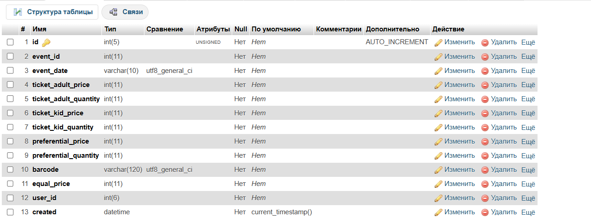
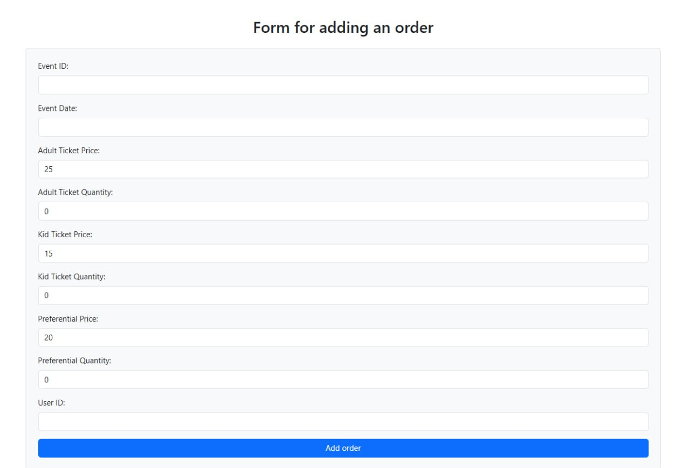
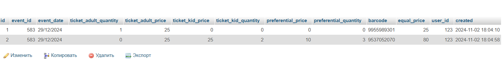
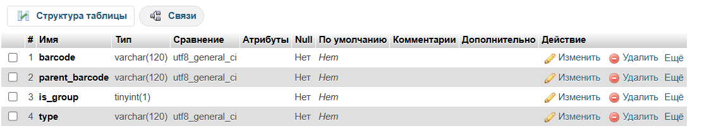
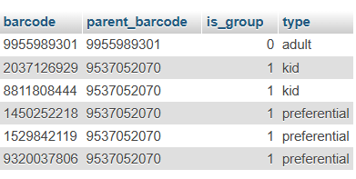

# Документация функции добавления заказов

## Общее описание
Этот документ описывает функцию PHP, которая призвана добавлять заказы в базу данных и обрабатывать ответы от сторонних API для брони и подтверждения заказов.

## Обзор файлов
### `add_order.php`
- Файл содержит процедуру добавления заказов в MySQL с помощью PHPMyAdmin.
- Прием данных осуществляется через POST-запрос, после чего скрипт проводит проверку данных и отправляет запрос на сторонную API для брони заказа.
- При получении ошибки от API (например, штрих-код уже существует), генерируется новый `barcode` и повторяется попытка брони.
- Структура базы данных заказов:

  

### `order_form.html`
- Отображает форму для ввода данных о заказе. Форма создана с использованием Bootstrap, обеспечивая стильное оформление.
- Поля в форме: `event_id`, `event_date`, `ticket_adult_price`, `ticket_adult_quantity`, `ticket_kid_price`, `ticket_kid_quantity`, `preferential_price`, `preferential_quantity`, `user_id`.
- Вид задания значений (количества, цены) предустановлены.

  

## Описание API и процесс (для теста используется рандомный ответ)
- **API бронирования**: отправка данных для подтверждения заказа через `https://api.site.com/book`.
- **API подтверждения**: запрос для подтверждения брони через `https://api.site.com/approve`.
- Ответы от API могут содержать сообщения об успешном подтверждении или ошибки (например, "event cancelled", "no tickets").

## Примеры данных и структура таблиц
- Таблица заказов:

  

- Таблица билетов:

  

  

## Объяснения задач 2.1 и 2.2
Добавлено в таблицу тип для льготных билетов. Групповые билеты сортируются автоматически, когда общее количество билетов >1, это помогает эффективно использовать интерфейс. Эта же сортировка используется для задачи 2.2, когда необходимо генерировать отдельные коды для каждого билета в группе. Цель создания новой таблицы-сортировать таблицы по типам билетов, сохранить отдельные баркоды. Связь между таблицами обеспечивается через столбцы `barcode` в таблице `orders` и `parent_barcode` в таблице `tickets`. 
